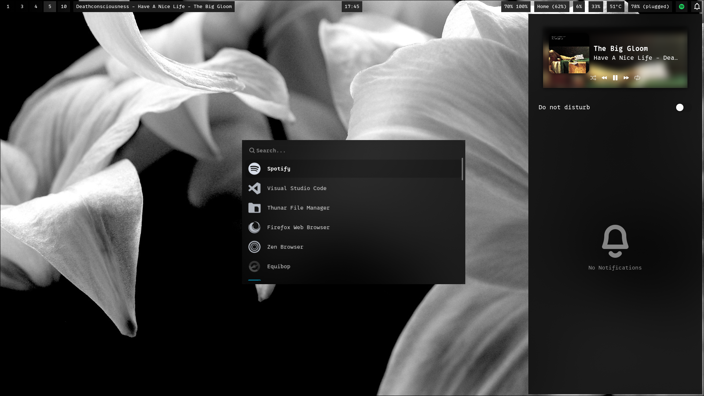
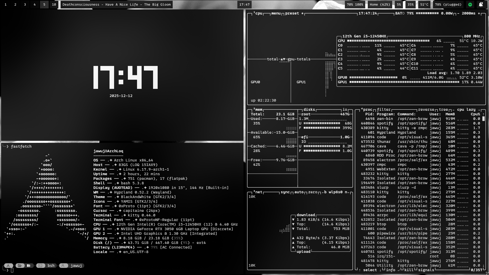
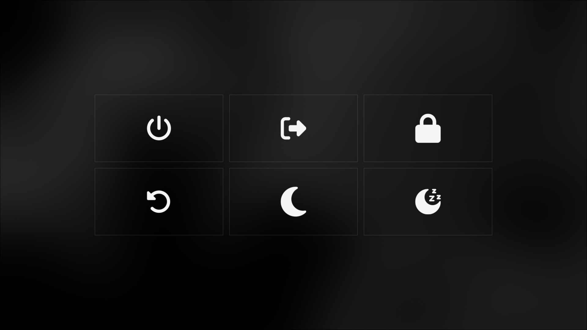

## Black & White (Arch Base)

<table border="0">
  <tr>
    <td></td>
    <td></td>
  </tr>
  <tr>
    <td></td>
    <td></td>
  </tr>
</table>

---

- **OS:** Arch Linux
- **WM:** Hyprland
- **Font:** Proto Nerd Font

- **App Launcher:** Wofi
- **Logout & Lock**: Wlogout - Hyprlock
- **Bar:** Waybar
- **Login Manager:** Ly

- **Terminal:** Kitty
- **Audio Visualizer Terminal:** Cava
- **System Information:** Fastfetch
- **Shell Promt:** Starship

- **Text Editor:** Nvim
- **File Manager:** Thunar - Yazi

## Apps (Downloaded In System)

- **Browser:** Zen
- **Notes App:** Obsidian
- **Music:** Spotify With Spicetify
- **Social:** Telegram & Discord (Vesktop)
- **Games:** Steam - Roblox, Minecraft & Cs2
- **Code:** Visual Studio
- **VM:** Virtual Box
- **Torrent:** Qbittorrent

## Dependencies

- Imagemagick
- Proto Nerd Font

Starship
https://github.com/commended

## Matugen (CachyOS)

<table border="0">
  <tr>
    <td></td>
    <td></td>
  </tr>
  <tr>
    <td></td>
    <td></td>
  </tr>
</table>
